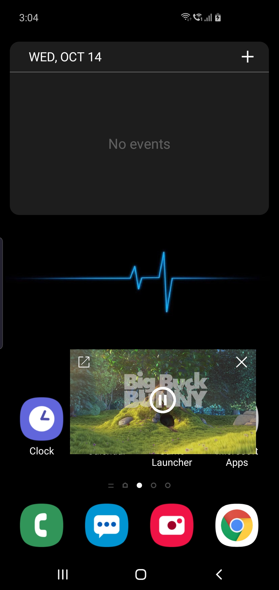

# kuma_player

A video player for flutter support video cache, and drawing on other app on android.

## Futures

- Cache video when playing, and play cached video offline.
- Support draw video on other app on Android.
    - Play and pause button.
    - Pan to move overlay video layer.
    - Pinch to zoom overlay video layer.

## Android configuration

The Video Proxy require the [network security configuration](https://developer.android.com/training/articles/security-config).

